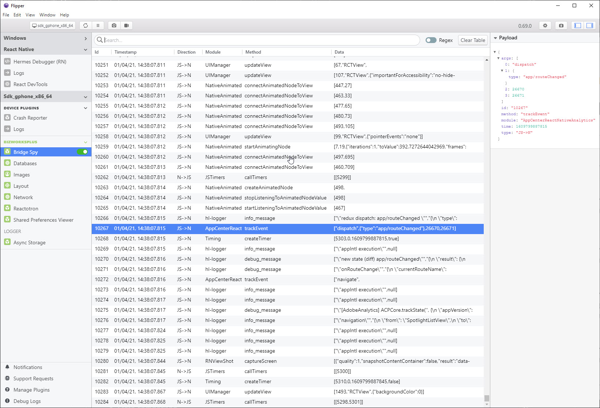

# Welcome to flipper-plugin-bridgespy 👋


[](https://github.com/sylvanaar/flipper-plugin-bridgespy#readme)
[](https://github.com/sylvanaar/flipper-plugin-bridgespy/graphs/commit-activity)
[](https://github.com/sylvanaar/flipper-plugin-bridgespy/blob/master/LICENSE)
[](https://gitmoji.dev)
[](https://snyk.io/test/github/sylvanaar/flipper-plugin-bridgespy?targetFile=package.json)

> React Native bridge spy Flipper plugin



## Install

You can install from inside Flipper using the 'Manage Plugins' option.

In order to work, you must install the flipper-plugin-bridgespy-client package in your React Native project

## Run tests

```sh
yarn run test
```

## Author

👤 **Jon Akhtar (sylvanaar)**

-   Github: [@sylvanaar](https://github.com/sylvanaar)

## Show your support

Give a ⭐️ if this project helped you!

## 📝 License

Copyright © 2021 [Jon Akhtar (sylvanaar)](https://github.com/sylvanaar).

This project is [MIT](https://github.com/sylvanaar/flipper-plugin-bridgespy/blob/master/LICENSE) licensed.

* * *

_This README was generated with ❤️ by [readme-md-generator](https://github.com/kefranabg/readme-md-generator)_
